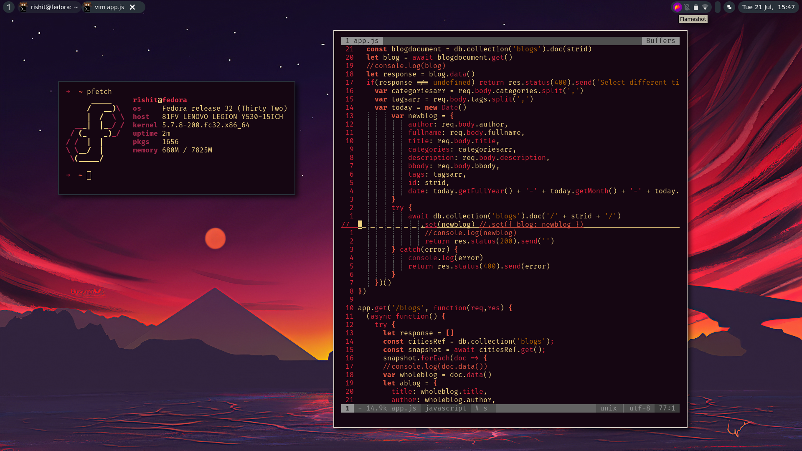

<div align='center'>
	<h1>AwesomeWM</h1>
</div>

## My Setup ##



## Connotation ##

- [My Setup](#my-setup)
- [Connotation](#connotation)
- [OS Details](#os-details)
- [About](#about)
- [Dependencies](#dependencies)
	- [Some Other Dependencies](#some-other-dependencies)
	- [Fonts](#fonts)
- [Installing](#installing)
- [Upcoming](#upcoming)

- [Installing](#installing)

<a name='details'><a>
## OS Details ##
+ **OS**      : Fedora Workstation 32
+ **Shell**   : oh-my-zsh
+ **WM**      : awesomewm
+ **Theme**   : Juno gtk3 theme
+ **Icons**   : Tela Green
+ **Cursor**  : Adwaita
+ **Terminal**: kitty
+ **Editor**  : micro

<a name=features></a>
## About ##
+ Lighter than usual desktop environments
+ Less RAM Usage and highly customizable
+ Very few dependencies required
+ Based on a programming langauge
+ No need to learn entire language
+ This configuration is based on the stable release of the awesomewm

<a name=dependencies></a>
## Dependencies ##
The dependencies are kept as low as possible and are common for all distros so the
config can be used by anyone willing to use awesomewm. Also these packages will most likey be available in the package manager of your linux distro.

| Dependency package name | What it does? |
| :---------------------:| :-----------------:|
| `awesome` | Window Manager |
| `feh` | Command line tool for setting up the wallpaper |
| `picom` | Composite manager for window managers |
| `rofi` | Application launcher or menu |
| `ImageMagick` | Used for theming and wallpaper | 


### Some Other Dependencies ###

```bash  
xfce4-power-manager
```
This will be the extension for the battery management for the people using laptops.

```bash
nautilus
```
The file manager for our system. Alternatively, we can go for other apps as well like thunar but this is my preferred one.

```bash
bluez blueman
```
The bluetooth module for our system.

```bash
xbacklight
```
A module to control the brightness. But this has to be configured accoring to your machine. If it works out of the box, perfect but if not use this [guide](https://askubuntu.com/questions/823669/volume-sound-and-screen-brightness-controls-not-working).


### Fonts ###

The system font that has been used is [SF Text](https://github.com/perrychan1/fonts.git) or you can download from official Apple website.

Terminal Font is Fira Code by default. It is possible that the font is available in the official repositories of your distro so you can install it from there or you can download from [here](https://github.com/tonsky/FiraCode)

<a name='installing'></a>
## Installing ##

The installation of my awesomewm config is very simple if you met all the dependencies and the fonts.
To install, clone this repository onto your system and place all the files into 

```bash
~/.config/awesome
```
And here you go, enjoy your awesomewm journey!

<a name='upcoming'></a>
## Upcoming ##

1. I will be updating the themes according to the wallpaper color schemes and will probably create a new branch for the newly themed version.

2. I will also document the code a little bit more and will explain the file structure for the beginners.

3. Will also be working on other wm configurations as I rice them XD